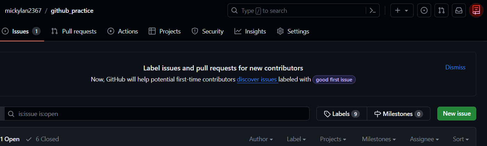
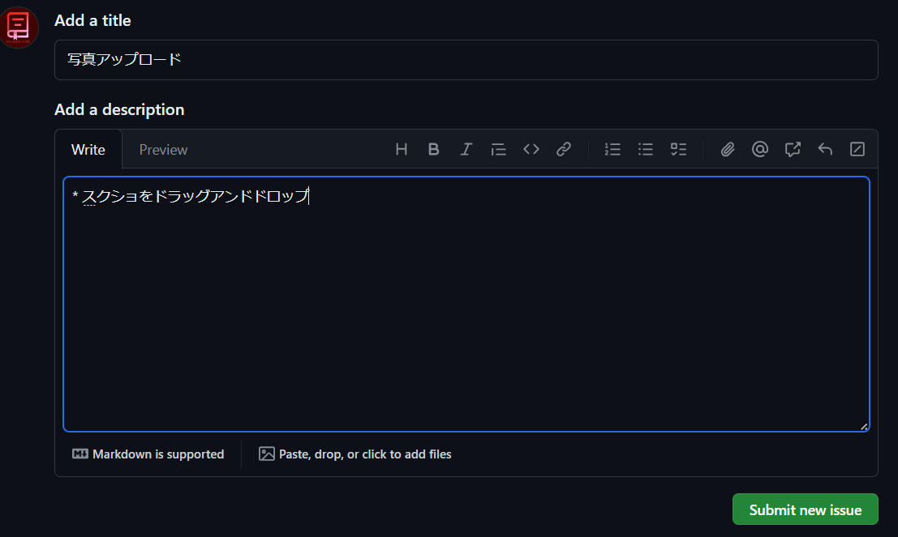
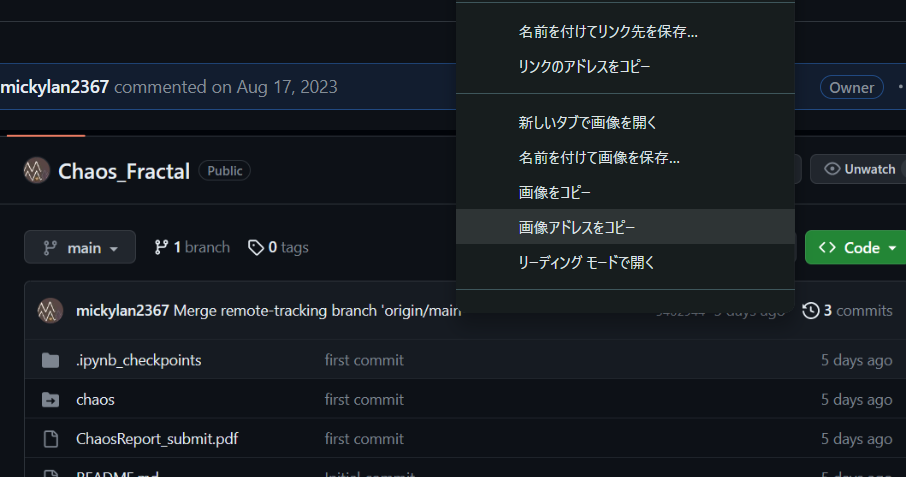
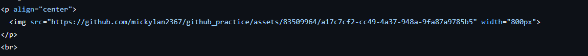

主な方法は二つです。

# スクショをREADME.mdに張る場合
1. Issuesを開いて、緑のNew Issuesを選択


2. 適当にタイトルをつけて、スクリーンショットをAdd DiscriptionにDrag and Drop!


3. 画像のアドレスをコピーして、README.mdファイルに使用



こんな感じ...!

# ファイルにアップロードした写真をREADME.mdに貼る場合
``````

```ex . ```

これでおk!


